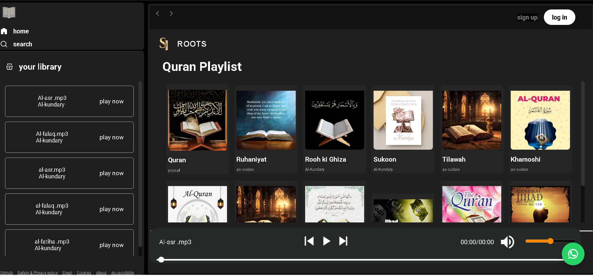

# 🕌 Rooh ka Sukoon — Quran Recitation Player | SI ROOTS` 

A Spotify-inspired Quran recitation player built entirely with **Vanilla HTML, CSS, and JavaScript** — no frameworks, no libraries by **SI ROOTS**.    
Browse recitation collections, stream audio, and control playback with a fully custom interface designed for peace and focus.

**[🌐 Live Demo](https://ikhansa623-source.github.io/Rooh-ka-Sukoon--Quran/)** 



---

## ✨ Overview

Rooh ka Sukoon organizes Quran recitations into album-style folders and streams them directly in the browser. 
Users can browse collections, pick a Surah, and control playback with a full set of media controls — all built from scratch.

---

## 🌟 Features

- **🎵 Dynamic Album Browsing** — Folders and audio files fetched live via GitHub API
- **▶️ Full Playback Controls** — Play, Pause, Next, Previous, Repeat
- **⏱️ Live Seek Bar** — Click-to-seek with real-time progress and duration
- **🔊 Volume Control** — With Mute/Unmute toggle
- **📱 Fully Responsive** — Works perfectly on Mobile, Tablet, and Desktop
- **🎨 Custom UI** — Spotify-style layout built with pure CSS
- **⚡ Lightweight** — No dependencies. Loads fast
---

## 🛠️ Built With

- **HTML5** — Semantic structure
- **CSS3** — Responsive layout, Glassmorphism, Custom media-player
- **JavaScript ES6+** — `fetch`, `async/await`, Native `Audio` API, DOM Manipulation
- **GitHub REST API** — To dynamically list folders and audio files

---
## 🤝 About SI ROOTS
- SI ROOTS builds Islamic web apps and interactive tools for the Muslim community worldwide.
- For custom Islamic projects or collaborations: Contact on WhatsApp

## 🧠 Key Concepts

- Working with the browser's native `Audio` object for play, pause, seek, and volume
- Fetching directory contents dynamically through GitHub API
- Handling asynchronous data with `async/await` and error fallbacks
- Building a reusable "Now Playing" state that syncs with UI

---

## ❓ Why GitHub API?

Static hosts like GitHub Pages don't support server-side directory listing.  
To keep the album/folder structure dynamic instead of hardcoding every filename, this project queries the GitHub Contents API at runtime.

---

## 🚀 Running Locally

No build tools or installation required.

1.  Clone the repository
    ```bash
    git clone https://github.com/ikhansa623-source/Rooh-ka-Sukoon--Quran.git